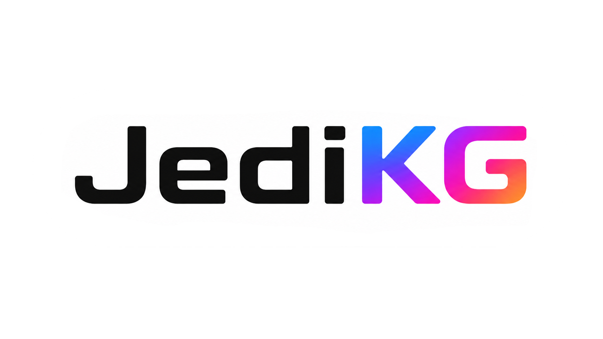
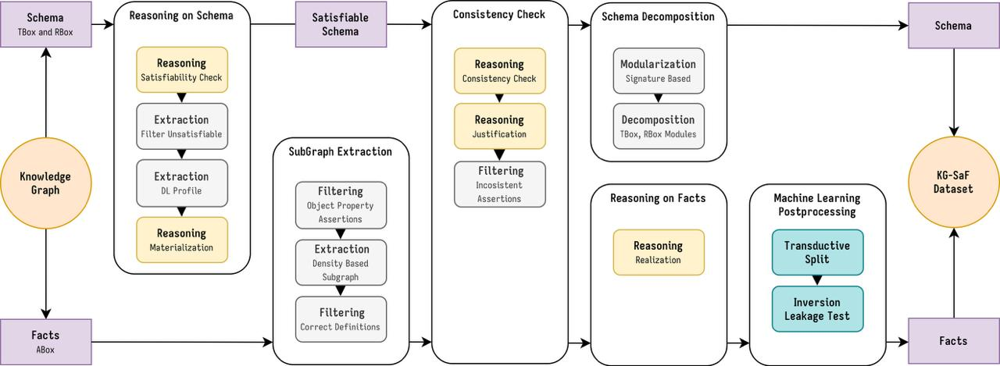

<p align="center">

</p>

---


[](https://doi.org/10.5281/zenodo.20024979)


[](https://ara-t3.github.io/jedikg/)
[](https://arxiv.org/abs/2602.14795)


**JediKG** provides a workflow (*JDeX*) and curated datasets  (*JDSet*) for knowledge graph refinement (KGR) and NeuroSymbolic (NeSY) research. The resource includes datasets with both **schema (ontologies)** and **ground facts**, making it ready for **machine learning** (PyKEEN, PyTorch) and **reasoning services** (Reasoners, Ontology Management Tools like Protege).

> Please read our official documentation at [ReadTheDocs Documentation](https://ara-t3.github.io/jedikg/)

---

## 🚀 Key Features
- 🗂️ Extracts datasets from RDF-based KGs with expressive schemas (RDFS/OWL2)  
- 📦 Provides datasets in **OWL** and **TSV** formats, easily loadable in both **PyTorch** and **Protege**  
- ⚡ Handles inconsistencies and leverages reasoning to infer implicit knowledge
- 🤖 Provides ML-ready **tensor representations** compatible with PyTorch and PyKEEN  
- 🧩 Offers **schema decomposition** into themed partitions (modularization of ontology components)
- 📄 Fully documented at [ReadTheDocs Documentation](https://ara-t3.github.io/jedikg/)

### Advanced Python Reasoning Integration
- 🔌 Provides a Python abstraction layer for reasoners, tightly integrated with RDFLib, enabling seamless use of multiple engines:
   - ☕ Java-based reasoners for materialization (HermiT, Elk)
   - ⚙️ Konclude (C++) for parallelizable consistency checking and realization
   - 🧩 Pellet for justification extraction
- 🔄 Automatically detects and removes unsatisfiable classes and object properties
- 🔍 Includes tools to analyze inconsistency justifications directly in Python

### Usability & Complete Customization
- 🖥️ Provides an interactive CLI-based interface for easy workflow management
- ⚙️ Fully configurable via JSON, allowing you to:
   - Select which reasoners to use
   - Choose specific reasoning services (e.g., materialization, consistency check, justification)
   - Customize all parameters for dataset generation

## **JDeX**: Dataset Extraction Tool Overview



##  **JDSet**: Dataset Suite Overview

### Available Ontologies (Schema) and Datasets

The table below lists the currently available **ontologies** and their corresponding **datasets** included in this resource. **All dataset come in two version, with and without materialization and realization services enabled.**
> Note: This table will be **updated** as new datasets and ontologies become available.


| Ontology | Datasets | DL Fragment |
|----------|---------|-------------|
| 📚 [DBpedia](https://www.dbpedia.org/resources/ontology/) | `DBPEDIA_50K_C`, `DBPEDIA_100K_C` | $\mathcal{ALCHF}$ |
| 📚 [YAGO3](https://yago-knowledge.org/downloads/yago-3) | `YAGO3_39K_C`, `YAGO3_10_C` | $\mathcal{ALHIF+}$ |
| 📚 [YAGO4](https://yago-knowledge.org/downloads/yago-4ap) | `YAGO4_20_C` | $\mathcal{ALCHIF}$ |
| 📚 [ArCo](http://wit.istc.cnr.it/arco) | `ARCO_20`, `ARCO_10`, `ARCO_5` | $\mathcal{SROIQ}$ |
| 📚 [WHOW](https://whowproject.eu/) | `WHOW_5` | $\mathcal{SROIQ}$ |
| 📚 [ERA](https://www.era.europa.eu/domains/registers/era-knowlege-graph_en) | `ERA_95`, `ERA_90`| $\mathcal{ALCRIQ}$ |


### Dataset File Structure

All datasets are provided in a **standardized format** following the **Description Logic (DL) formalization**, separating the dataset into **ABox** (instance-level data), **TBox** (schema-level information), and **RBox** (roles and properties)
> 📄 Files marked with this icon are **new serializations or variations** of the same data already available in OWL format (e.g., TSV or JSON representations), intended for easier use in ML pipelines.

```
📁 abox ......................................... # Assertional Box (instance-level data)
│ ├── 📁 splits ................................. # Train/test/validation splits
│ │ ├── 🦉 train.nt ............................. # Training triples (N-Triples)
│ │ ├── 🦉 valid.nt ............................. # Validation triples (N-Triples)
│ │ ├── 🦉 test.nt .............................. # Test triples (N-Triples)
│ │ ├── 📄 train.tsv ............................ # Training triples (TSV)
│ │ ├── 📄 valid.tsv ............................ # Validation triples (TSV)
│ │ └── 📄 test.tsv ............................. # Test triples (TSV)
│ │
│ ├── 🦉 individuals.owl ........................ # Individuals definitions
│ ├── 🦉 class_assertions.owl ................... # Individuals class assertions (OWL)
│ ├── 📄 class_assertions.json .................. # Individuals class assertions (JSON)
│ │
│ ├── 🦉 obj_prop_assertions.nt ................. # Combined triples (N-Triples)
│ └── 📄 obj_prop_assertions.tsv ................ # Combined triples (TSV)

📁 rbox ......................................... # Role Box (relations and properties)
│ ├── 🦉 roles.owl .............................. # Role definitions
│ ├── 📄 roles_domain_range.json ................ # Domain and range of roles (JSON)
│ └── 📄 roles_hierarchy.json ................... # Role hierarchy (JSON)

📁 tbox ......................................... # Terminological Box (schema-level info)
│ ├── 🦉 classes.owl ............................ # Class non-taxonomical axioms
│ ├── 🦉 taxonomy.owl ........................... # Hierarchical taxonomy
│ └── 📄 taxonomy.json .......................... # Hierarchical taxonomy (JSON)

🦉 knowledge_graph.owl .......................... # Full merged TBox + RBox + ABox
🦉 ontology.owl ................................. # Core modularized schema

📁 mappings ..................................... # Mappings to IDs
│ ├── 🧾 class_to_id.json ....................... # Map ontology classes to IDs
│ ├── 🧾 individual_to_id.json .................. # Map entities/instances to IDs
│ └── 🧾 object_property_to_id.json ............. # Map object properties to IDs
```

## Tutorials

In the `tutorial` folder, we provide example notebooks demonstrating how to use JediKG datasets and tools. This folde also contains an example of configuration files and example inputs to test out the JDeX extraction pipeline!

1. **Loading a PyTorch dataset using the custom `KnowledgeGraph` class**  
   - File: `tutorial/torch_loader.ipynb`  
   - Description: Shows how to load a dataset from JediKG into PyTorch tensors using the `KnowledgeGraph` class, including train/test/validation splits and schema-aware representations.  

2. **Proof of concept: Using PyKEEN for machine learning on JediKG datasets**  
   - File: `tutorial/pykeen_training.ipynb`  
   - Description: Demonstrates a basic pipeline for training a Knowledge Graph Embedding (KGE) model using PyKEEN on one of the JediKG datasets, including evaluation.  


# Citation
```bibtex
@misc{diliso2026returnschemabuildingcomplete,
      title={Return of the Schema: Building Complete Datasets for Machine Learning and Reasoning on Knowledge Graphs}, 
      author={Ivan Diliso and Roberto Barile and Claudia d'Amato and Nicola Fanizzi},
      year={2026},
      eprint={2602.14795},
      archivePrefix={arXiv},
      primaryClass={cs.AI},
      url={https://arxiv.org/abs/2602.14795}, 
}
```
